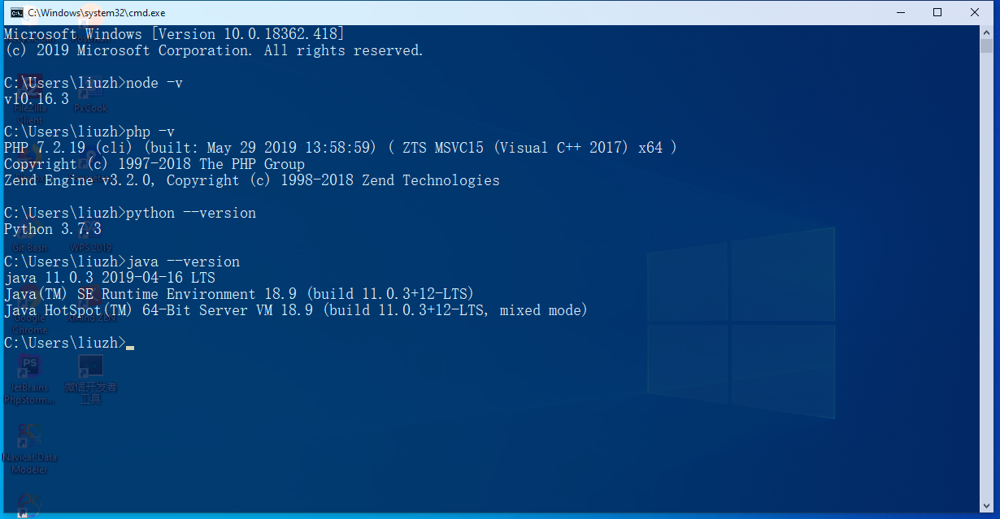
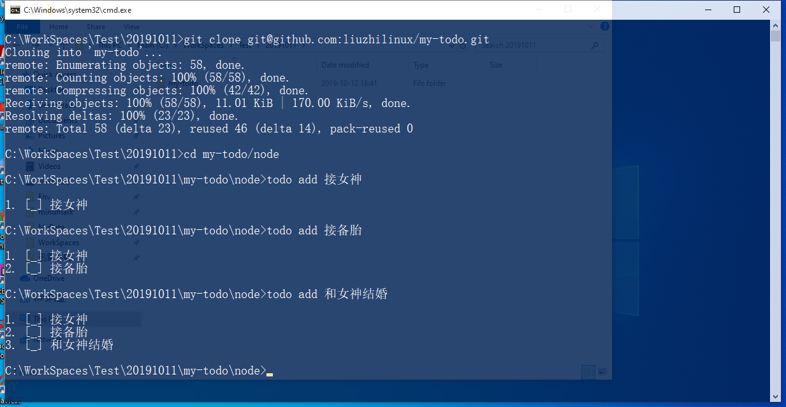
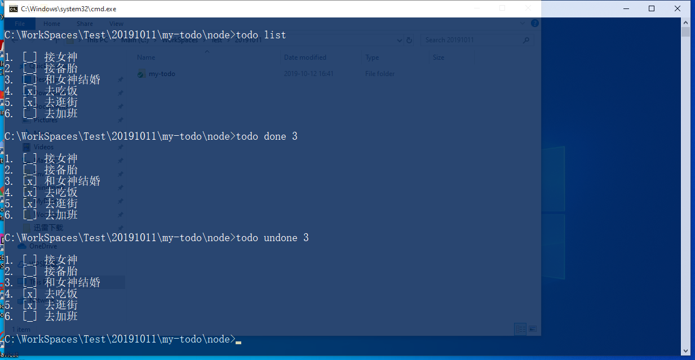
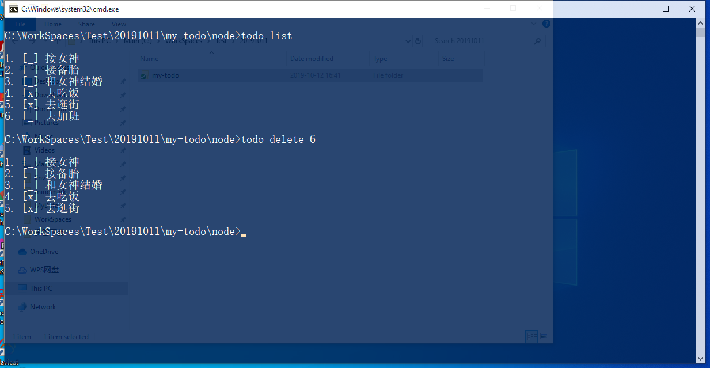
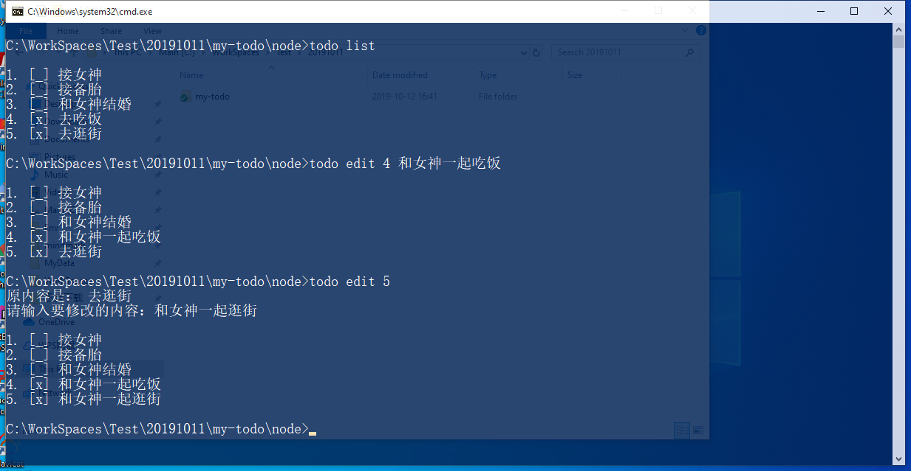

# my-todo
[TOC]


> 每个人都想成为制定规则的那个人，但相较而言，遵守规则更加重要，也更困难。


## 说明

这个项目是根据方应杭老师在“写代码啦”上发布的免费课程《Node.js 入门》做的练手项目。关于这个课程，可以点击[这里](https://xiedaimala.com/courses/75e749fb-909e-4e10-9212-b6e725a6d35f#/common "Node.js 入门 - 写代码啦！")了解。

相对比原课程中的案例，我做了如下修改：

1. `todo` 命令添加 `undone` 、 `moveup` 、 `movedown` 、`clearall` 指令；
2. 采用 `Node.js `、 `PHP` 、 `Java` 、`Python` 实现一致的功能，包括 `todo` 命令的用法和 `db` 保存数据格式的统一；
3. 解决了 Windows 下无法添加 `todo` 命令到别名的问题。

## 我的运行环境



## 如何使用

下面以 `node` 版本为例。

1. 克隆项目到本地：

   ```bash
   $ git clone git@github.com:liuzhilinux/my-todo.git
   ```

2. 切换到项目中对应的 `node` 目录：

   ```shell
   $ cd my-todo/node
   ```

3. 可以开始通过命令行操作了，以下是所有命令的用例：

   > 克隆项目到本地，并添加 3 个任务（ `add` ）：
   >
   > 1. 接女神
   > 2. 接备胎
   > 3. 和女神结婚
   >
   > 现在，戏精附体中...

   

   >你看了下列表，其中已完成和待完成的任务映入眼帘（ `list` ），
   >
   >你和女神吃过饭逛过街了，幻想着和女神结婚指日可待，于是你将第 3 项任务标记为已完成（ `done` ）,
   >
   >但是天朝的房价把你拉回了现实，想要和女神结婚，你还要再奋斗几年，于是，你默默的将任务标记回待完成（ `undone` ）。

   

   >你再看一眼任务列表，发现你还要回去加班，但是你还想多陪女神一会，所以，去™的加班吧。
   >
   >你默默的把第 6 项任务删除了（ `delete` ）。

   

   >你和女神腻歪了一整天，晚上回到家，瞅了一眼任务列表，发现第 4 项和第 5 项任务的内容有点表述不清，于是，你打算编辑它们（ `edit` ）。

   

## 参见

1. [Node.js 入门 - 写代码啦！](https://xiedaimala.com/courses/75e749fb-909e-4e10-9212-b6e725a6d35f#/common "Node.js 入门 - 写代码啦！")
2. [Node.js 官方英文文档](https://nodejs.org/api/)
3. [Node.js 中文文档](http://nodejs.cn/api/ "API 文档 | Node.js 中文网")
4. 

