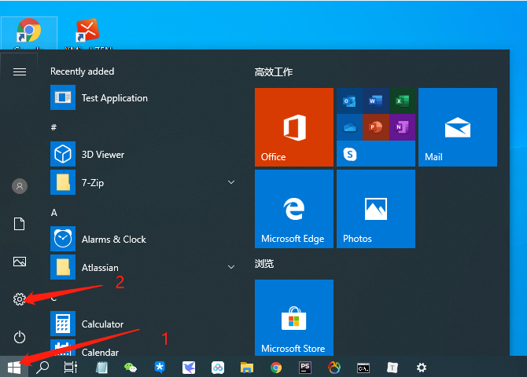
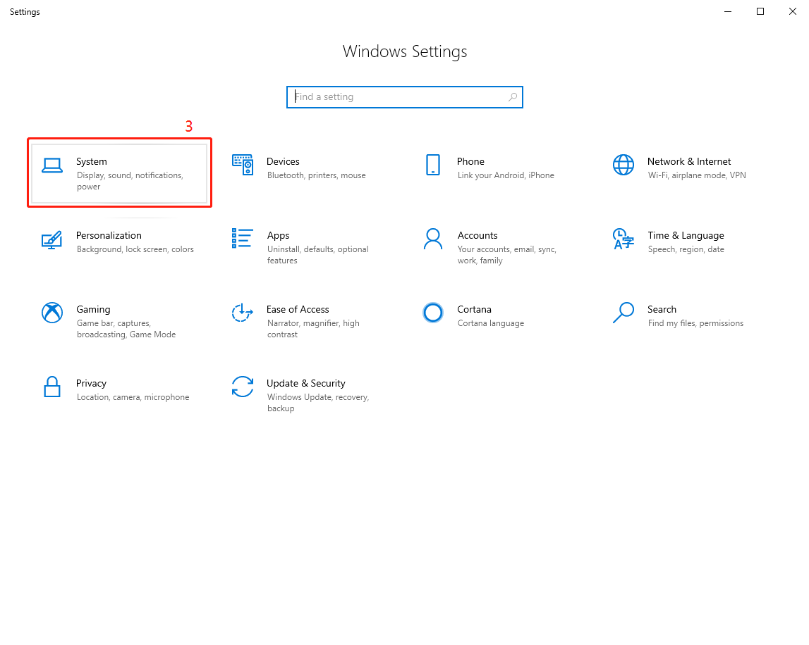
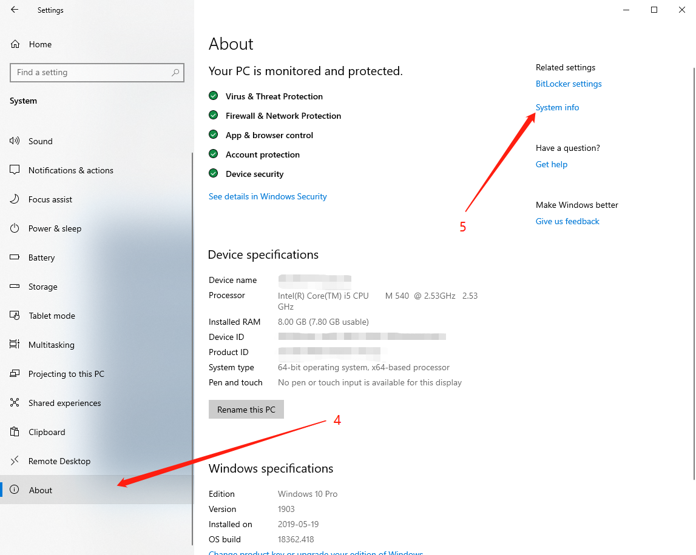
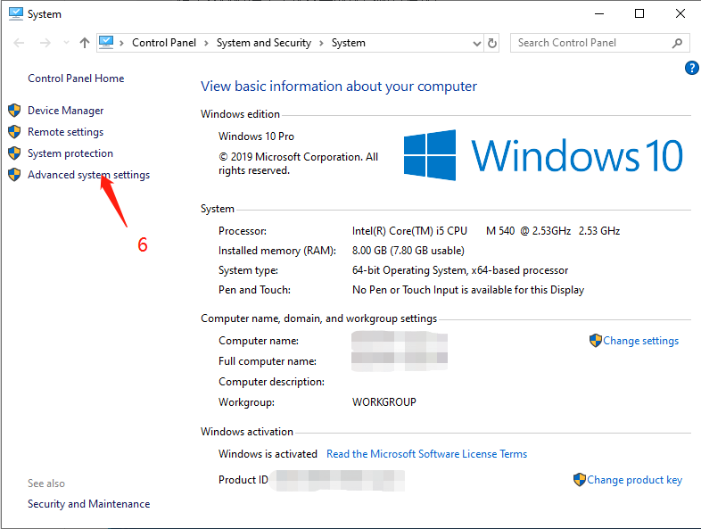
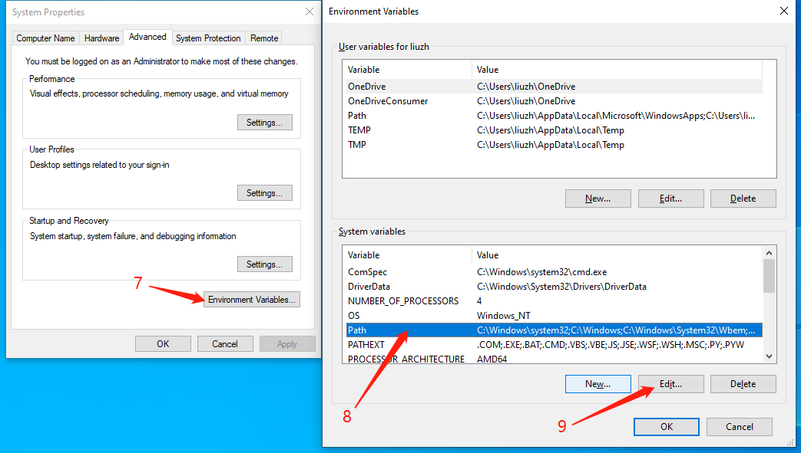
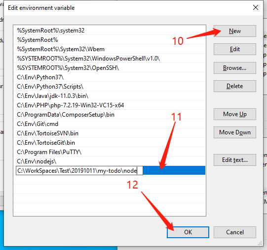
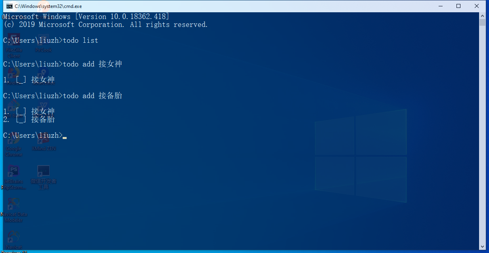

# my-todo
[TOC]


> 每个人都想成为制定规则的那个人，但相较而言，遵守规则更加重要，也更困难。


## 说明

这个项目是根据方应杭老师在“写代码啦”上发布的免费课程《Node.js 入门》做的练手项目。关于这个课程，可以点击[这里](https://xiedaimala.com/courses/75e749fb-909e-4e10-9212-b6e725a6d35f#/common "Node.js 入门 - 写代码啦！")了解。

相对比原课程中的案例，我做了如下补充：

1. `todo` 命令添加 `undone` 、 `moveup` 、 `movedown` 、`clearall` 指令；
2. `edit` 指令支持通过命令行交互的方式编辑任务；
3. 采用 `Node.js `、 `PHP` 、 `Java` 、`Python` 实现一致的功能，包括 `todo` 命令的用法和 `db` 保存数据格式的统一；
4. 解决了 Windows 下无法添加 `todo` 命令到别名的问题。

这个项目以及这份文档是面向零编程基础的，同时有接触过命令行的朋友，所以这份文档会尽量写得通俗易懂，这样难免会有些啰嗦，但对新手来说，足够细致的说明。


## 我的运行环境


## 如何使用

下面以 `Node.js` 版本为例。

1. 克隆项目到本地：

   ```bash
   $ git clone git@github.com:liuzhilinux/my-todo.git
   ```

2. 切换到项目中对应的 `node` 目录：

   ```shell
   $ cd my-todo/node
   ```

3. 现在可以开始通过命令行操作了，以下是所有命令的用例：

   > 克隆项目到本地，并添加 3 个任务（ `add` ）：
   >
   > 1. 接女神
   > 2. 接备胎
   > 3. 和女神结婚
   >
   > 现在，戏精附体中...

   

   >你看了下列表，其中已完成和待完成的任务映入眼帘（ `list` ），
   >
   >你和女神吃过饭逛过街了，幻想着和女神结婚指日可待，于是你将第 3 项任务标记为已完成（ `done` ）,
   >
   >但是天朝的房价把你拉回了现实，想要和女神结婚，你还要再奋斗几年，于是，你默默的将任务标记回待完成（ `undone` ）。

   

   >你再看一眼任务列表，发现你还要回去加班，但是你还想多陪女神一会，所以，去™的加班吧。
   >
   >你默默的把第 6 项任务删除了（ `delete` ）。

   

   >你和女神腻歪了一整天，晚上回到家，瞅了一眼任务列表，发现第 4 项和第 5 项任务的内容有点表述不清，于是，你打算编辑它们（ `edit` ）。

   


## 全局使用 `todo` 命令

这里主要讨论在 Windows 下的全局使用 `todo` 命令的方式，在 GNU/Linux 下全局使用 `todo` 命令可以自行了解 `alias` 的使用，这里不再赘述。

在 Windows 下想要添加 `todo` 命令到别名，从而达到全局使用 `todo` 命令的目的，主要有两种方法：

1. 借助 `cmd` 下的 `DOSKEY` 命令；
2. 编写批处理脚本，并将脚本所在的路径添加到全局变量中；

第一种方法是需要修改注册表，这种方式不太友好，所以我选择了第二种方法，以下是演示步骤，还是以 `Node.js` 版本为例：

1. 将项目克隆到本地，这里假设你的工作目录为 `C:\WorkSpaces\Test\20191011` ：

   ```powershell
   > C:
   > cd C:\WorkSpaces\Test\20191011
   > git clone git@github.com:liuzhilinux/my-todo.git
   > cd my-todo\node
   ```

2. 建立文件 `todo.bat` ，当然，如果你新克隆了项目到本地，那么在每个 `todo` 版本目录下都应该已经存在了这个文件（ `Java` 版本需要编译，将在后面有详细讲解）：

   ```
   REM 关闭命令回显，同时不显示本条命令。
   @echo off
   
   REM %~dp0 表示批处理所在的路径，%1 %2 %3 表示命令后的 3 个参数。
   node "%~dp0todo" %1 %2 %3
   ```

   其实到这里，细心的朋友已经注意到了，如果是在命令行环境下跑`Node.js` 程序，原本的命令应该是：

   ```powershell
   > node todo list
   ```

   或

   ```powershell
   > node todo.js list
   ```

   但是项目下的 `node` 目录以及存在了 `todo.bat` 文件，所以你可以执行：

   ```powershell
   > todo list
   ```

   相当于执行：

   ```powershell
   > node C:\WorkSpaces\Test\20191011\my-todo\node\todo.js list
   ```

   其中，参数 `list` 将通过 `%1` 传入给到 `todo.js` 脚本。

3. 现在，设置环境变量，以 Windows 10 为例，其他系统版本自行查找方法：

   > 开始菜单 -> 设置 -> 系统 -> 关于 -> 系统信息 -> 高级设置

   

   

   > 系统变量 ->选中 Path -> 编辑 -> 添加 -> 输入路径 -> 保存

   

   

   

   

   > 接下来依次点击确定关闭窗口。

4. 全局 `todo` 命令配置完成，现在可以试试看了，记得**重新打开命令行**才有效果哦。

   

## 关于 `Java` 版本的编译与运行

下面是 `java/todo.bat` 里面的内容：

```powershell
@echo off

REM 设置当前目录
SET here=%~dp0

REM 删除编译生成的 class 文件
REM 正式使用可以注释这 3 行
del %here%Todo.class
del %here%Todo$1.class
del %here%Todo$Task.class

REM 编译 java 源代码
REM 正式使用可以注释这行
javac "%here%Todo.java" -encoding UTF-8 -d "%here:~0,-1%"

REM 执行 java todo 命令
java --class-path "%here:~0,-1%" Todo %1 %2 %3

```


## 写在后面

学习编程，最重要的是兴趣，然后是实践，最后是思考。只要对编程有兴趣，你才会坚持学习下去，也只有在实践中，你的技术才会进步，而最后思考，是最终使你达到不一样的境界。


## 参见

`JavaScript & Node.js`

1. [Node.js 入门 - 写代码啦！](https://xiedaimala.com/courses/75e749fb-909e-4e10-9212-b6e725a6d35f#/common "Node.js 入门 - 写代码啦！")
2. [JavaScript | MDN](https://developer.mozilla.org/zh-CN/docs/Web/JavaScript)
3. [Node.js 官方英文文档](https://nodejs.org/api/)
4. [Node.js 中文文档](http://nodejs.cn/api/ "API 文档 | Node.js 中文网")
5. [JavaScript教程 - 廖雪峰的官方网站](https://www.liaoxuefeng.com/wiki/1022910821149312)
6. [FreeCodeCamp 国外版](https://www.freecodecamp.org/)
7. [FreeCodeCamp 中文 one](https://www.freecodecamp.one/)

`Python`

1. [Python 3 官方英文文档](https://docs.python.org/3/)
2. [Python 教程 - 廖雪峰的官方网站](https://www.liaoxuefeng.com/wiki/1016959663602400)

`Java`

1. [JDK 11 Documentation](https://docs.oracle.com/en/java/javase/11/)
2. [Java教程 - 廖雪峰的官方网站](https://www.liaoxuefeng.com/wiki/1252599548343744)

`PHP`

1. [PHP 手册](https://www.php.net/manual/zh/)


